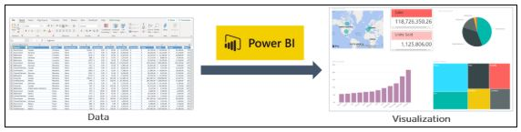

## Powerbi

 
Microsoft Power BI is a data visualization platform used primarily for business intelligence purposes. Power BI stands for Power Business Intelligence and refers to a set of software tools and connectors that help you transform data from multiple sources into actionable insights.

Designed to be used by business professionals with varying levels of data knowledge, Power BI’s dashboard is capable of reporting and visualizing data in a wide range of different styles, including graphs, maps, charts, scatter plots, and more.
